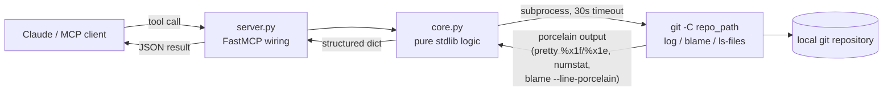

# mcp-git-historian

<!-- mcp-name: io.github.AleBrito124356/mcp-git-historian -->

[](https://github.com/AleBrito124356/mcp-git-historian/actions/workflows/tests.yml)
[](https://pypi.org/project/mcp-git-historian/)
[](https://pypi.org/project/mcp-git-historian/)
[](LICENSE)

**MCP server for git archaeology — churn hotspots, blame summaries, bus factor, commit forensics and file history over any local repository.**

## Why

Every codebase carries answers to the questions that matter most during maintenance: *Which files keep breaking? Who actually knows this legacy module? When did this weird constant appear? What happens if that one developer leaves?* The answers are buried in git history, but digging them out means chaining `log`, `blame`, `shortlog` and pickaxe invocations with arcane flags — so nobody does it.

`mcp-git-historian` gives your AI assistant those forensic tools directly. It shells out to the `git` CLI you already have (no extra dependencies, no network calls, nothing leaves your machine) and returns structured, LLM-friendly summaries: hotspot rankings, ownership percentages, knowledge silos, and the exact commit where a piece of code first showed up.

## Tools

| Tool | Arguments | Returns |
|---|---|---|
| `repo_summary` | `repo_path` | Current branch, total commits, first/last commit (hash + date), top 10 contributors, commits per month for the last 12 months |
| `hotspots` | `repo_path`, `since="1 year ago"`, `top=15` | Files ranked by commits touching them + lines added/deleted; deleted files excluded; top 3 flagged as high-churn refactor candidates |
| `file_history` | `repo_path`, `file`, `limit=20` | Commits that touched the file (hash, date, author, subject, +/- lines), following renames via `--follow` |
| `blame_summary` | `repo_path`, `file` | % of surviving lines per author, dominant author, dates of the oldest and newest lines |
| `bus_factor` | `repo_path`, `top=10` | Per top-level directory: dominant author and share of commits, knowledge silos (>80% one author); global bus factor (min authors covering >50% of commits) |
| `search_commits` | `repo_path`, `query`, `author=""`, `since=""`, `limit=20` | Case-insensitive commit-message search (`git log --grep`) with optional author/date filters |
| `find_change` | `repo_path`, `pattern`, `file=""`, `limit=10` | Commits that added/removed the pattern via pickaxe (`git log -S`) — "when did this code appear?" (`-S` tracks occurrence-count changes; `-G` would also match moved lines) |

## How it works



All parsing relies on machine-friendly git output: custom `--pretty` formats with ASCII unit/record separators (`%x1f`/`%x1e`), `--numstat` for line churn, and `blame --line-porcelain` for ownership. Everything runs locally against repositories on your disk.

## Quickstart

No install needed — `uvx` fetches and runs it:

**Claude Desktop** (`claude_desktop_config.json`):

```json
{
  "mcpServers": {
    "git-historian": {
      "command": "uvx",
      "args": ["mcp-git-historian"]
    }
  }
}
```

**Claude Code:**

```bash
claude mcp add git-historian -- uvx mcp-git-historian
```

Prefer a permanent install? `pip install mcp-git-historian`, then use `mcp-git-historian` as the command.

Requires Python 3.10+ and the `git` CLI on your PATH.

## Example session

> **User:** Nobody on the team dares to touch `legacy/parser.py`. Who actually knows that module, and how risky is it?
>
> **Claude:** *(calls `blame_summary(repo_path="/work/acme-api", file="legacy/parser.py")`)*
>
> Ownership is extremely concentrated: **Alice Dev wrote 94.6% of the surviving lines** (Bob Ops has the remaining 5.4%). The oldest line dates to 2019-03-11 and the newest to 2024-08-02 — it is old code, but still being touched.
>
> *(calls `bus_factor(repo_path="/work/acme-api")`)*
>
> The `legacy/` directory is a **knowledge silo**: Alice authored 96.2% of all commits touching it. The repository's global bus factor is **2** — just two people account for more than half of all commits. If Alice is unavailable, `legacy/` has no realistic second owner.
>
> **User:** And where did that `MAGIC_TOKEN` constant in the parser even come from?
>
> **Claude:** *(calls `find_change(repo_path="/work/acme-api", pattern="MAGIC_TOKEN", file="legacy/parser.py")`)*
>
> The pickaxe found exactly one commit that introduced it: `a1b2c3d` (2019-04-02, Alice Dev) — *"feat: add legacy parser handshake token"*. It has never been removed or re-added since, so that constant has survived untouched for years. I'd recommend pairing someone with Alice on the next `legacy/` change and starting with tests around `parse()`.

## Development

```bash
git clone https://github.com/AleBrito124356/mcp-git-historian
cd mcp-git-historian
pip install -e ".[dev]"
python -m pytest
```

You can also run the server straight from the source tree with `python -m mcp_git_historian.server`.

The test suite builds a real throwaway git repository (two authors, a rename, a deleted file, pinned commit dates) and never imports `mcp`, so it runs with plain pytest.

## Related MCP servers

Part of a family of small, dependency-light MCP servers:

- [mcp-decision-lab](https://github.com/AleBrito124356/mcp-decision-lab) — weighted decision matrices with sensitivity analysis
- [mcp-devils-advocate](https://github.com/AleBrito124356/mcp-devils-advocate) — stress-test a claim: devil's advocate, premortem, assumption audits
- [mcp-secret-sentinel](https://github.com/AleBrito124356/mcp-secret-sentinel) — scan code for exposed secrets, always redacted
- [mcp-memory-vault](https://github.com/AleBrito124356/mcp-memory-vault) — persistent memory with SQLite FTS5 search

## License

MIT — see [LICENSE](LICENSE).
