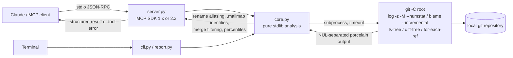

# mcp-git-historian

<!-- mcp-name: io.github.AleBrito124356/mcp-git-historian -->

[](https://github.com/AleBrito124356/mcp-git-historian/actions/workflows/tests.yml)
[](LICENSE)

**MCP server and CLI for git archaeology: rename-aware churn hotspots, change coupling, knowledge-loss risk, bus factor, blame and commit forensics over any local repository.**

## Why

Every codebase carries answers to the questions that matter most during maintenance. *Which files keep breaking? Which files secretly depend on each other? Who actually knows this legacy module, and is that person still around? When did this weird constant appear?* The answers are buried in git history. Digging them out means chaining `log`, `blame`, `shortlog` and pickaxe invocations with arcane flags, then fixing up renames, duplicate identities and merge commits by hand, so nobody does it.

`mcp-git-historian` gives your AI assistant, or your terminal, those forensic tools directly. It shells out to the `git` CLI you already have. Nothing leaves your machine and there are no API keys or network calls. It returns structured, LLM-friendly results: hotspot rankings, coupled file pairs, orphaned files, ownership percentages and the exact commit where a piece of code first showed up.

## Tools

Every tool is read-only and is annotated as such (`readOnlyHint`, `idempotentHint`) for MCP clients.

| Tool | Arguments (defaults) | Returns |
|---|---|---|
| `repo_summary` | `repo_path`, `include_merges=false` | Branch, total and merge commits, first/last commit, number of authors, top 10 contributors, commits per month for the last 12 months |
| `hotspots` | `repo_path`, `since="1 year ago"`, `top=15` | Files ranked by commits touching them, with +/- lines and `churn_percentile`. Renames are followed (`renamed_from`) and deleted files excluded. Only real outliers get a `hint` (see [the rules](#what-the-numbers-mean)) |
| `change_coupling` | `repo_path`, `file=""`, `since="1 year ago"`, `min_shared=3`, `max_files_per_commit=30`, `top=20` | Files that keep changing in the same commits: shared commits, `degree` (shared / min revisions) and `jaccard`. With `file`, that file's partners |
| `knowledge_risk` | `repo_path`, `inactive_after="6 months ago"`, `top=20`, `path=""`, `max_files=200` | *What breaks if someone leaves?* Blame-based ownership against each author's last commit: `orphaned` files, a per-author rollup (lines, files as main owner, last commit) and a per-directory rollup |
| `bus_factor` | `repo_path`, `top=10`, `include_merges=false` | Global bus factor (the fewest authors covering >50% of commits), plus the dominant author and knowledge silos per top-level directory |
| `file_history` | `repo_path`, `file`, `limit=20` | Commits that touched the file (hash, date, author, subject, +/- lines), following renames |
| `blame_summary` | `repo_path`, `file` | % of surviving lines per author, dominant author, dates of the oldest and newest lines |
| `commit_details` | `repo_path`, `ref` | Full message, author/committer, parents (merge detection), every file with status A/M/D/R/C/T and +/- lines, old path for renames, branches and tags that contain it |
| `search_commits` | `repo_path`, `query`, `author=""`, `since=""`, `limit=20`, `regex=false` | Case-insensitive commit-message search. The query is **literal text** by default, so `[WIP]` just works; `regex=true` for POSIX extended regexes |
| `find_change` | `repo_path`, `pattern`, `file=""`, `limit=10`, `regex=false` | Commits where the pattern was added or removed (pickaxe `git log -S`), following `file` across renames; `regex=true` switches to `git log -G` |
| `health_report` | `repo_path`, `since="1 year ago"`, `inactive_after="6 months ago"`, `top=10`, `max_files=200` | Everything above as one Markdown report, including a *what to look at first* list |

`repo_path` can be the repository root **or any folder inside it**. A sub-folder scopes the analysis to that folder. File arguments are relative to the repository root, and absolute paths inside the repository work too. Errors come back as MCP tool errors with an actionable message ("Repo not found at … pass an absolute path", "limit must be at least 1", "Invalid regular expression … pass regex=false"), so the model can fix its own call.

## What the numbers mean

The analyses are only useful if their numbers are right, so these rules are explicit, tested, and echoed in the results:

- **Renames are followed.** Commits made under a file's former names count towards its current name (`hotspots`, `change_coupling`, `file_history`, `find_change` with `file`).
- **One person is one author.** Identities go through [`.mailmap`](https://git-scm.com/docs/gitmailmap) everywhere (`%aN`), exactly like `git blame`, so `Alice Dev <alice@work>` and `alice <alice@home>` are not two people.
- **Merges are not authorship.** Merging a pull request is not writing its code. `repo_summary` and `bus_factor` exclude merge commits unless `include_merges=true` and report how many were excluded. Churn and coupling always ignore them, because their changes were already counted in the commits they merge.
- **Hotspot flag:** a file gets the `hint` only with **≥ 3 commits and `churn_percentile` ≥ 90** (the top decile of files changed in the window). The percentile uses mid-ranks, so when many files tie nobody stands out.
- **Knowledge silo:** a directory with **≥ 3 commits** where one author made **> 80%** of them.
- **Orphaned file:** authors with no commit since `inactive_after` own **> 50%** of its lines at HEAD.
- **Coupling noise filter:** commits touching more than `max_files_per_commit` files (reformatting sweeps, vendoring) are skipped and counted in `commits_skipped_large`.
- **Dates:** `since` / `inactive_after` accept any git date (`"6 months ago"`, `"2025-01-01"`). Results echo the resolved date (`since_date`), and nonsense that git would silently read as "now" is rejected.

## Install

> Not yet published to PyPI or the MCP registry (`server.json` and the `mcp-name` marker are ready for when it is). Install it straight from GitHub.

Requires Python 3.10+ and the `git` CLI on your PATH. The MCP Python SDK is installed automatically; both major versions work (tested with mcp 1.10.0, 1.30.0 and 2.2.0).

With [uv](https://docs.astral.sh/uv/) nothing is installed permanently:

```bash
uvx --from git+https://github.com/AleBrito124356/mcp-git-historian mcp-git-historian --version
```

Or with pip, into any virtual environment:

```bash
pip install "git+https://github.com/AleBrito124356/mcp-git-historian"
mcp-git-historian --version
```

### Use it from an MCP client

Launched with no arguments, `mcp-git-historian` is a stdio MCP server.

**Claude Desktop** (`claude_desktop_config.json`):

```json
{
  "mcpServers": {
    "git-historian": {
      "command": "uvx",
      "args": ["--from", "git+https://github.com/AleBrito124356/mcp-git-historian", "mcp-git-historian"]
    }
  }
}
```

If you installed with pip instead, use `"command": "/absolute/path/to/venv/bin/mcp-git-historian"` (on Windows, `...\\Scripts\\mcp-git-historian.exe`) and no `args`.

**Claude Code:**

```bash
claude mcp add git-historian -- uvx --from git+https://github.com/AleBrito124356/mcp-git-historian mcp-git-historian
```

## Command line

Every tool is also a sub-command, so you can use and demo it without any MCP client:

| Command | Tool |
|---|---|
| `mcp-git-historian summary REPO [--include-merges]` | `repo_summary` |
| `mcp-git-historian hotspots REPO [--since S] [--top N]` | `hotspots` |
| `mcp-git-historian coupling REPO [--file F] [--since S] [--min-shared N] [--max-files-per-commit N] [--top N]` | `change_coupling` |
| `mcp-git-historian knowledge-risk REPO [--inactive-after D] [--path P] [--top N] [--max-files N]` | `knowledge_risk` |
| `mcp-git-historian bus-factor REPO [--top N] [--include-merges]` | `bus_factor` |
| `mcp-git-historian history REPO FILE [--limit N]` | `file_history` |
| `mcp-git-historian blame REPO FILE` | `blame_summary` |
| `mcp-git-historian commit REPO REF` | `commit_details` |
| `mcp-git-historian search REPO QUERY [--author A] [--since S] [--limit N] [--regex]` | `search_commits` |
| `mcp-git-historian find-change REPO PATTERN [--file F] [--limit N] [--regex]` | `find_change` |
| `mcp-git-historian report REPO [--since S] [--inactive-after D] [--top N] [-o FILE]` | `health_report` |
| `mcp-git-historian` or `mcp-git-historian serve` | run the MCP server over stdio |

Output is a readable table. Add `--json` for the exact tool result. Tool errors print `error: …` and exit with status 1. `python -m mcp_git_historian …` works as well.

Real output, run on this repository at commit `e5666be` (the absolute path is shortened):

```text
$ mcp-git-historian hotspots . --since "" --top 5
Churn hotspots in /path/to/mcp-git-historian — all history

  commits  added  deleted  pctl  flag  file
  -------  -----  -------  ----  ----  --------------------------------------------
        4  +1460     -206  89.5        mcp_git_historian/core.py  (was core.py)
        4   +691     -145  89.5        tests/test_core.py
        4   +377      -90  89.5        mcp_git_historian/server.py  (was server.py)
        4    +47       -4  89.5        pyproject.toml
        3   +142      -28  76.3        README.md

19 files changed; flagged when a file has >= 3 commits and churn_percentile >= 90 (top decile of the 19 files changed in the window).
```

`core.py` and `server.py` started at the repository root and were moved into the package later. Their earlier commits still count, and the tie at 4 commits means no file is a statistical outlier, so nothing is flagged.

```text
$ mcp-git-historian coupling . --since "" --top 4
Change coupling in /path/to/mcp-git-historian — all history

  shared  degree  jaccard  pair
  ------  ------  -------  --------------------------------------------------
       4    1.00     1.00  mcp_git_historian/core.py  <->  tests/test_core.py
       4    1.00     1.00  mcp_git_historian/server.py  <->  pyproject.toml

2 pairs found; 9 commits analysed, 0 skipped for touching more than 30 files.
```

### Health report

`mcp-git-historian report REPO -o health.md` writes a deterministic Markdown report (no timestamps, no absolute paths) that you can commit, diff or paste into an issue. The first lines of `mcp-git-historian report . --since "" --top 5` for this repository at the same commit:

````markdown
# Git health report: mcp-git-historian

Generated by mcp-git-historian 0.2.0 at commit `e5666be` (2026-09-23) on branch `improve/mcp2-accurate-history-cli`. Churn and coupling window: all history.

## Summary

- **10 commits** (1 merge) from 2026-07-23 to 2026-09-23, by **1 author** (mailmap-resolved, merges excluded).
- **Bus factor 1**: the smallest number of authors who together made more than half of all authored commits.
- **0 churn hotspots** among 19 files changed in the window.
- **2 coupled file pairs** (>= 3 shared commits).
- **0 orphaned files** of 19 analysed (inactive = no commit since 2026-03-23).

## Activity (authored commits per month)

```text
2025-10 ▁▁▁▁▁▁▁▁▁▇▁█ 2026-09
```

Peak: 5 commits in 2026-09.

## What to look at first

Files that change often **and** carry a knowledge or coupling risk:

1. `mcp_git_historian/core.py`: 4 commits in the window; single owner: Alejandro Brito wrote 100% of it; changes together with `tests/test_core.py` (degree 1.00).
2. `mcp_git_historian/server.py`: 4 commits in the window; single owner: Alejandro Brito wrote 100% of it; changes together with `pyproject.toml` (degree 1.00).
````

The full report continues with the rest of that list, the hotspot table, coupled pairs, directory silos, orphaned files and code ownership. *What to look at first* ranks files with ≥ 3 commits in the window that are also orphaned (weight 3), single-owner (weight 1) or strongly coupled (degree ≥ 0.5, weight 1). A one-person project like this one naturally shows "single owner" everywhere. On a team repository, this list is where orphaned hotspots show up.

## How it works



- Parsing relies on machine-friendly git output: custom `--pretty` formats with ASCII unit/record separators, NUL-terminated `--numstat -z` / `--name-status -z` records (paths with spaces or `=>` in them parse exactly), and `blame --incremental`.
- Every git call pins the config that could corrupt parsing (`log.showSignature`, colours, log encoding, rename detection, path quoting). It also sets `LC_ALL=C`, so error messages are the same whatever your locale, and never takes optional locks.
- `knowledge_risk` blames files in parallel and caps the work at `max_files` (the most frequently changed files first), with an explicit `truncated` flag.

Measured on a synthetic repository with 30,000 commits and 3,000 files (Windows 11, Python 3.14): `hotspots` over all history 3.2 s, `bus_factor` 3.3 s, `change_coupling` over all history 3.1 s, `knowledge_risk` with 200 blamed files 8.8 s, and `repo_summary` 0.4 s. Each single git call stays far below the timeout.

## Configuration

| Environment variable | Default | Meaning |
|---|---|---|
| `GIT_HISTORIAN_TIMEOUT` | `30` | Seconds each git invocation may run before the tool returns a timeout error. Raise it for very large repositories |

## Development

```bash
git clone https://github.com/AleBrito124356/mcp-git-historian
cd mcp-git-historian
python -m venv .venv
.venv/bin/python -m pip install -e ".[dev]"      # Windows: .venv\Scripts\python
.venv/bin/python -m pytest
```

The suite (81 tests) builds two real throwaway git repositories with pinned dates. The first is the original small fixture. The second, a *forensics* fixture, reproduces every trap the analysis has to handle: a second identity reconciled by `.mailmap`, a merge-only integrator, a rename followed by edits, a `[WIP]` commit message, a 32-file mass commit, an author who left, and a tag.

- `tests/test_core.py` covers the analyses with exact expected values and never imports `mcp`.
- `tests/test_cli.py` covers every sub-command and the report.
- `tests/test_server.py` speaks the real protocol: the installed SDK's own client in-process, plus a subprocess driven with raw JSON-RPC over stdio. It is skipped when `mcp` is not installed.

To check the other SDK major version, install it into a second environment, e.g. `pip install -e ".[dev]" "mcp>=1.10,<2"`, and run `pytest` again.

## Related MCP servers

Part of a family of small, dependency-light MCP servers:

- [mcp-decision-lab](https://github.com/AleBrito124356/mcp-decision-lab): weighted decision matrices with sensitivity analysis
- [mcp-devils-advocate](https://github.com/AleBrito124356/mcp-devils-advocate): stress-test a claim with devil's advocate, premortem and assumption audits
- [mcp-secret-sentinel](https://github.com/AleBrito124356/mcp-secret-sentinel): scan code for exposed secrets, always redacted
- [mcp-memory-vault](https://github.com/AleBrito124356/mcp-memory-vault): persistent memory with SQLite FTS5 search

## License

MIT, see [LICENSE](LICENSE).
